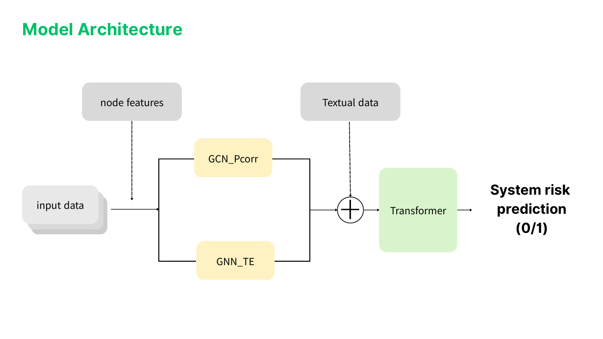

# Systemic Risk Detection via Spatio-Temporal Multi-Graph Embedding

This project proposes a novel deep learning framework to detect **Systemic Risk** in financial markets by capturing both static correlations and dynamic causalities between assets.

---

## Research Motivation

Most existing literature defines “Systemic Risk” as an abstract concept, such as the “possibility of financial system collapse.” However, to train an AI model, a precise and logical numerical criterion is essential.

Traditional prediction models often fail during extreme market stress because they cannot account for the nonlinear contagion paths and extreme synchronization of assets. Our research formalizes this abstract concept into a hybrid, engineering-based label to build a more robust risk-monitoring framework.

---

## Key Methodologies

### 1. Hybrid Systemic Risk Labeling (Our Definition)

- We introduced a rolling-window relative threshold and a hybrid **AND logic** to distinguish between a simple bear market and a true systemic collapse.
- **Synchronization Requirement**: A crisis is only defined as "Systemic Risk" if the Market Synchronization Index exceeds a critical threshold (θ = 0.9).
- **Multi-Factor Triggers**: Systemic Risk is labeled when high synchronization coincides with either a significant price crash (bottom p% of 252-day rolling returns) or a volatility spike (top p% of VIX changes).

### 2. Dual-Branch Graph Embedding

- **GCN Branch (Undirected)**: Analyzes the return structure to capture static spatial correlations and market clustering.
- **GNN_TE Branch (Directed)**: Utilizes transfer entropy (or a Granger proxy) to identify dynamic causality and information flow/contagion paths between assets.

### 3. Spatio-Temporal Fusion & Transformer

- **Fusion Layer**: Combines the dual graph embeddings with global macro features such as VIX, TED Spread, Gold, and Sentiment.
- **Transformer Block**: Learns long-term temporal dependencies from the fused spatio-temporal tensors to output a final Systemic Risk classification.

---

## Tech Stack

| Category             | Tools / Libraries                              |
|----------------------|-----------------------------------------------|
| Language             | Python 3.12+                                  |
| Deep Learning        | PyTorch (GCN, GNN, Transformer)               |
| Econometrics         | ARCH (EGARCH modeling), NetworkX (Graph Centrality) |
| Data Sources         | Yahoo Finance (market data), Benzinga (news sentiment) |

---

## Performance & Vision

Our framework demonstrates superior robustness in high-complexity regimes where standard models lose predictive power. By acting as a "Risk Monitoring Filter," this model can protect investors and minimize social costs during black swan events like the COVID-19 shock or the 2022 rate hike cycle.

---

## Additional Resources

- **Images**: Store architecture diagrams or result plots in the `docs/` folder and reference them above.
- **Presentation (PDF)**: Place slide decks under `presentation/SystemicRisk_presentation.pdf` and link as follows:

  `[View slides](presentation/SystemicRisk_presentation.pdf)`

---

